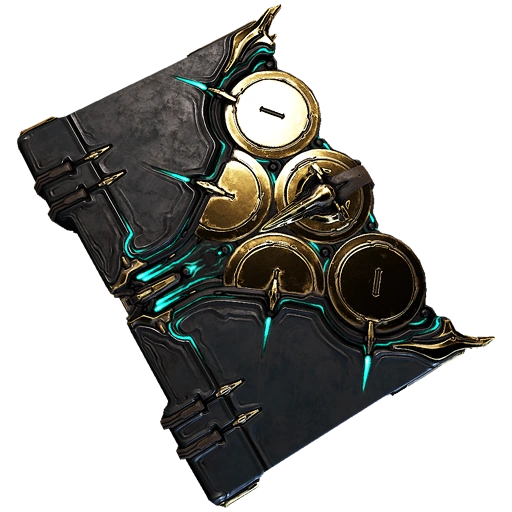

#  Grimoire Engine

### A Simple Text Adventure Engine for Interactive Narratives



## What is Grimoire Engine?

Grimoire Engine is a **YAML-driven interactive story engine** built with Vue and TypeScript.  
Providing both writers and game designers with the tools to create deep, branching and dynamic narrative  
experiences using simple configuration and no programming knowledge required.

### Key Features

**YAML-Based Game Definition**  
> Write an entire branching text based story game in a single YAML file

**Room-Based Exploration**
> Create interconnected spaces with changing descriptions and contextual actions

**Event-Driven Logic**
> Chain events with condition checks connected to both item inventory and player interactions

**Dialogue System**
> Build branching conversations with defined characters, open to player-driven branching choices

**Runtime Modification** 
> Provides dynamic room updates and event outcomes based on player progress and actions 

**Beautiful UI**
> Comes with a storybook-inspired front end desing with fade animations and light and dark themes as well as being very simple and open to be edited or fully replaced with a custom UI themes 

**Type-Safe** 
> Full TypeScript with Zod validation ensures game files are error-free, and unique accessible error messages to decode script issues 

**Save Functionality** 
> Includes a fully implemented save system allowing for both autosaves and user selected save slots, available  
to be downloaded and cleanly imported for seamless story progression across multiple PC environments


---

## Table of Contents

1. [Essential YAML Rules](#essential-yaml-rules)
2. [Required File Structure](#required-file-structure)
3. [Creating Rooms](#creating-rooms)
4. [Writing Events](#writing-events)
5. [Adding Dialogues](#adding-dialogues)
6. [Common Mistakes](#common-mistakes)
7. [Quick Start Template](#quick-start-template)
8. [Testing Your File](#testing-your-file)
9. [Checklist](#checklist)
10. [Quick Reference](#quick-reference)


---

## Essential YAML Rules

### 1. Always Use 2 Spaces (Never Tabs)

```yaml
rooms:           # 0 spaces
  cottage:       # 2 spaces
    actions:     # 4 spaces
```

### 2. Use Quotes for Text with Apostrophes

```yaml
text: "It's a room"     # GOOD
text: It's a room       # BREAKS
```

### 3. Null Means "End" or "None"

```yaml
next: ~        # Ends dialogue
next: null     # Same thing
```

That's it for YAML syntax. Now let's build a game.

---

## Required File Structure

Every YAML file needs these 4 things:

```yaml
version: 1              # Your personal version of your game
spawn: start            # First room ID

rooms:                  # Your rooms go here
  start:
    # room stuff

events: {}              # Can be empty
```

Optional sections (add when needed):
```yaml
characters:             # For dialogues
  wizard:
    name: "Wizard"
    color: "#9b59b6"

dialogues:              # Conversations when talking to characters
  greeting:
    # dialogue stuff
```

---

## Creating Rooms

### Basic Room

```yaml
rooms:
  cottage:
    shortDescription: "A cozy cottage"
    longDescription: "A small cottage with a thatched roof and warm fireplace. An old wizard sits by the fire."
    actions:
      "Look around":
        print: "You see a fireplace and old furniture."
```

### Room with Navigation

```yaml
rooms:
  cottage:
    shortDescription: "A cozy cottage"
    actions:
      "Go outside":
        - print: "You step outside."
        - go: garden
  
  garden:
    shortDescription: "A garden"
    actions:
      "Go inside":
        - print: "You go back inside."
        - go: cottage
```

### Room with Items

```yaml
rooms:
  cottage:
    shortDescription: "A cozy cottage"
    actions:
      "Take key":
        - print: "You pick up the key."
        - callFunctions:
            addItem: [key]
      
      "Try door":
        check:
          test: hasItem
          arguments: [key]
          failed:
            print: "The door is locked. You need a key."
        - print: "You unlock the door!"
        - go: next_room
```

### onEntry / onExit

```yaml
rooms:
  cottage:
    shortDescription: "A cozy cottage"
    onEntry:                          # Runs when entering room
      print: "You feel warmth from the fireplace."
    onExit:                           # Runs when leaving room
      print: "You take one last look."
    actions:
      # ...
```

---

## Writing Events

Events are things that happen. Here are the types you'll use:

### Print Text

```yaml
print: "Text to display"
```

### Change Room

```yaml
go: room_id
```

### Multiple Things (Chain)

```yaml
chain:
  - print: "First thing"
  - print: "Second thing"
  - go: next_room
```

Or as inline array:
```yaml
- print: "First thing"
- print: "Second thing"
- go: next_room
```

### Check Conditions

```yaml
check:
  test: hasItem            # or hasFlag
  arguments: [key]
  failed:                  # What happens if check fails
    print: "You need a key!"
```

If check passes, continues to next events.

**Built-in tests:**
- `hasItem` - Check if player has item
- `hasFlag` - Check if flag is true

### Modify Game State

```yaml
callFunctions:
  addItem: [sword]              # Add to inventory
  removeItem: [old_sword]       # Remove from inventory
  setFlag: [met_wizard, true]   # Set flag to true
```

### Start Dialogue

```yaml
dialogue: wizard_greeting
```

### Update Rooms

```yaml
updateRooms:
  cottage:
    actions:
      "New action":
        print: "This action appears now!"
```

---

## Adding Dialogues

### Step 1: Define Characters

```yaml
characters:
  wizard:
    name: "Aldric the Wizard"
    color: "#9b59b6"
```

### Step 2: Create Dialogue

```yaml
dialogues:
  wizard_greeting:
    start: hello              # Starting node ID
    nodes:
      hello:                  # Node ID
        message:
          speaker: wizard
          text: "Welcome, traveler!"
          next: ask_help      # Go to next node
      
      ask_help:
        message:
          speaker: wizard
          text: "Will you help me?"
          choices:            # Player choices
            - ["Yes", agree]
            - ["No", decline]
      
      agree:
        message:
          speaker: wizard
          text: "Thank you!"
          next: ~             # End dialogue
      
      decline:
        message:
          speaker: wizard
          text: "I understand."
          next: ~
```

### Dialogue with Events

```yaml
nodes:
  give_reward:
    events:
      - print: "The wizard gives you a key."
      - callFunctions:
          addItem: [magic_key]
    next: thank_you
```

### Conditional Choices

```yaml
nodes:
  shop:
    message:
      speaker: merchant
      text: "What do you want?"
      choices:
        - ["Sword (need 100 gold)", buy_sword]
        - text: "Magic ring (need key)"
          next: buy_ring
          condition: hasItem:magic_key
          else: no_key
```

### Branch (If/Else)

```yaml
nodes:
  check_item:
    branch:
      condition: hasItem:key
      true: has_key_node
      false: no_key_node
```

---

## Common Mistakes

### WRONG: Using Tabs
```yaml
rooms:
	cottage:    # WRONG: Tab used
```
**Fix:** Use 2 spaces

### WRONG: Wrong Indentation
```yaml
rooms:
  cottage:
   shortDescription: "Text"    # WRONG: Only 1 space
```
**Fix:** Always 2 spaces per level

### WRONG: Missing Quotes
```yaml
text: It's broken    # WRONG: Apostrophe breaks it
```
**Fix:** `text: "It's fixed"`

### WRONG: Referencing Non-Existent Room
```yaml
actions:
  "Go north":
    go: forrest    # WRONG: Typo! Should be "forest"
```
**Fix:** Double-check room IDs

### WRONG: Unreachable Room
```yaml
spawn: start
rooms:
  start:
    actions:
      "Wait": null
  
  secret_room:    # WRONG: No way to get here!
```
**Fix:** Add action to reach it

### WRONG: Circular Dialogue
```yaml
nodes:
  loop:
    message:
      text: "Hello"
      next: loop    # WRONG: Loops forever!
```
**Fix:** Add `choices` or end with `next: ~`

### WRONG: Missing Character Definition
```yaml
dialogues:
  greeting:
    nodes:
      hello:
        message:
          speaker: wizard    # WRONG: Not defined!
```
**Fix:** Add to `characters:` section

---

## Quick Start Template

We have also provided some simple templates for scripts below for you to copy and use as a starting point:

```yaml
version: 1
spawn: start

rooms:
  start:
    shortDescription: "Starting room"
    longDescription: "A detailed description of the starting room."
    actions:
      "Look around":
        print: "You examine your surroundings carefully."
      
      "Go north":
        - print: "You head north."
        - go: north_room
  
  north_room:
    shortDescription: "Northern room"
    actions:
      "Go back":
        - print: "You return south."
        - go: start

events: {}
```

### With Items and Flags

```yaml
version: 1
spawn: start

rooms:
  start:
    shortDescription: "A room with a locked door"
    actions:
      "Take key":
        - print: "You pick up the key."
        - callFunctions:
            addItem: [key]
      
      "Try door":
        check:
          test: hasItem
          arguments: [key]
          failed:
            print: "The door is locked."
        - print: "You unlock the door!"
        - callFunctions:
            setFlag: [door_unlocked, true]
        - go: next_room
  
  next_room:
    shortDescription: "Beyond the door"
    actions:
      "Look":
        print: "You made it!"

events: {}
```

### With Dialogue

```yaml
version: 1
spawn: village

rooms:
  village:
    shortDescription: "Village square"
    actions:
      "Talk to guard":
        dialogue: guard_chat

characters:
  guard:
    name: "Village Guard"
    color: "#e74c3c"

dialogues:
  guard_chat:
    start: greeting
    nodes:
      greeting:
        message:
          speaker: guard
          text: "Hello, traveler. Need something?"
          choices:
            - ["Just passing through", goodbye]
            - ["Tell me about the village", info]
      
      info:
        message:
          speaker: guard
          text: "It's a peaceful village. Welcome!"
          next: goodbye
      
      goodbye:
        message:
          speaker: guard
          text: "Safe travels!"
          next: ~

events: {}
```

---

## Testing Your File

1. **Save as `your-game.yml`**
2. **Put in `/public/assets/` folder**
3. **Update `game-definition.ts`:**
   ```typescript
   await fetch('/assets/your-game.yml')
   ```
4. **Open browser console (F12)**
5. **Look for errors**

Common console errors:
- `Spawn room must exist` --> Check `spawn:` value
- `Node X not found` --> Check node IDs in dialogue
- `Event X not found` --> Check event names

---

## Checklist

Before testing, verify:

- [ ] `version:` at top
- [ ] `spawn:` points to a room that exists
- [ ] `rooms:` and `events:` sections exist
- [ ] Every `go:` references a real room
- [ ] Every dialogue `next:` references a real node
- [ ] Every `speaker:` is defined in `characters:`
- [ ] Used 2 spaces (not tabs)
- [ ] Quoted strings with apostrophes

---

## Quick Reference

### Events
```yaml
print: "Text"
go: room_id
check:
  test: hasItem
  arguments: [item_name]
callFunctions:
  addItem: [item_name]
  setFlag: [flag_name, true]
dialogue: dialogue_name
```

### Dialogue Node
```yaml
node_id:
  message:
    speaker: character_id
    text: "Text"
    next: next_node_id    # or ~
```

### Dialogue with Choices
```yaml
node_id:
  message:
    speaker: character_id
    text: "Text"
    choices:
      - ["Choice 1", node1]
      - ["Choice 2", node2]
```

---

That's everything you need to create games with your engine. Start simple, test often, and build up from there!
